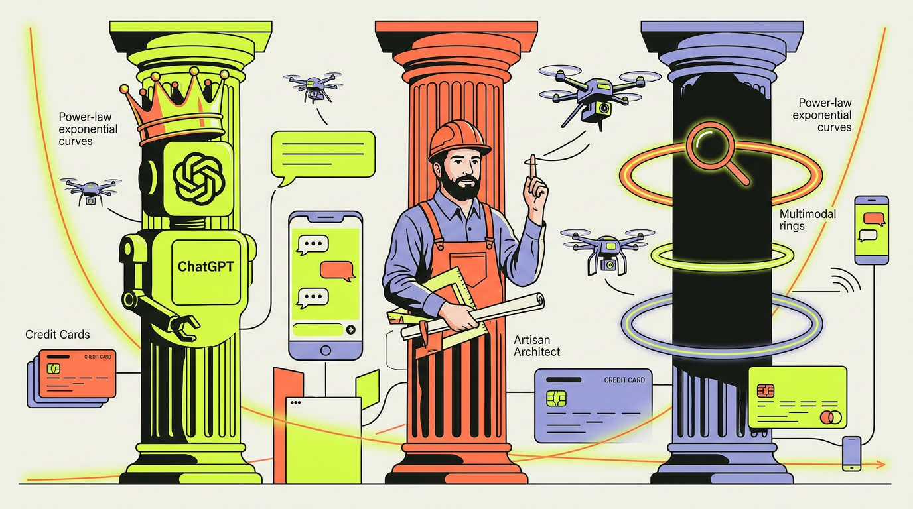
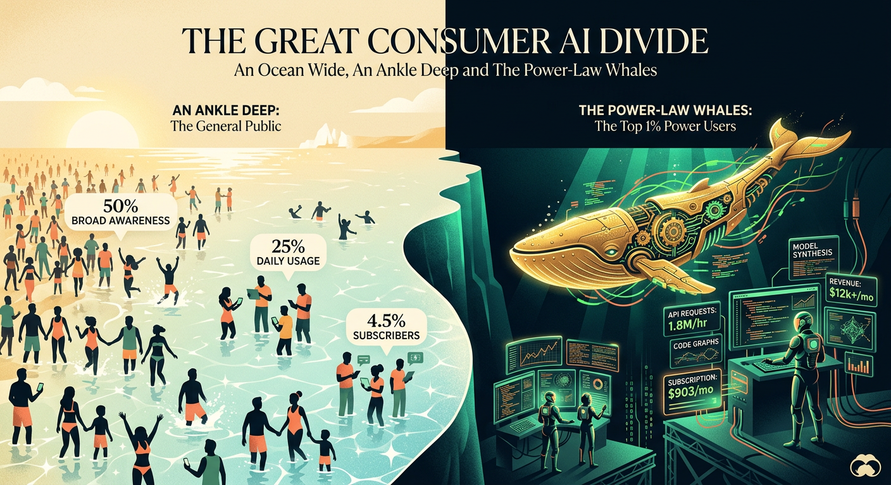
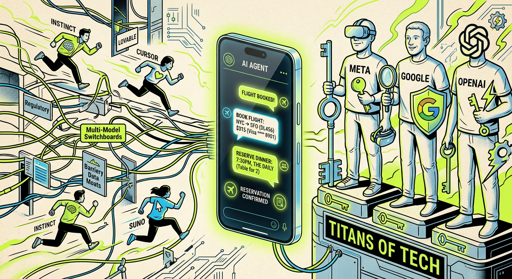

<div align="center">

# ⚡ APEX AI CONSUMER INDEX ⚡
### *An Ocean Wide, An Ankle Deep — The 7th Edition Gen AI Field Guide*

[](https://iggym.github.io/apex-ai-consumer-index/)
[-ff7654?style=for-the-badge&logo=readme&logoColor=white)](https://a16z.com/100-gen-ai-apps-7/)
[](https://a16z.com/100-gen-ai-apps-7/)
[](https://iggym.github.io/apex-ai-consumer-index/)

<br/>



<br/>

> *“Three years into the generative revolution, consumer AI is a glittering ocean a thousand miles wide—yet barely ankle deep for the casual pedestrian. Meanwhile, in the pitch-black trenches below, a tiny cabal of code-forging, prompt-crafting whales spends money like drunken sailors on shore leave.”*

</div>

---

## 🧭 Executive Dispatch: The State of the Consumer Matrix

Inspired by Olivia Moore’s landmark report, [**“The Top 100 Gen AI Consumer Apps — 7th Edition”** *(a16z, October 2026)*](https://a16z.com/100-gen-ai-apps-7/), the **Apex AI Consumer Index** is an interactive, razor-sharp digital telescope dissecting how real humans use, abandon, worship, and pay for Artificial Intelligence. 

While the tech world trumpets billions of monthly visits, **traffic numbers have become a digital funhouse mirror**. For the first time in history, credit-card panel data from **YipitData** reveals the naked truth: **massive foot traffic does not equal full cash registers**, and the consumer AI economy is being hoisted on the shoulders of an elite prosumer vanguard.

Explore the companion interactive dashboard directly in your browser:  
👉 **[Launch the Interactive Apex AI Consumer Index](https://iggym.github.io/apex-ai-consumer-index/)**

---

## 👑 Act I: Three Titans, Three Distinct Chessboards

The foundational model arena is no longer a chaotic barroom brawl; it has crystallized into **three distinct empires waging three completely different wars**. Across a dizzying barrage of **127 product launches in six months**, the triumvirate has carved up the digital map:

```
┌─────────────────────────────────────────────────────────────────────────────────┐
│                          THE TRIARCHY AT A GLANCE                               │
├────────────────────┬──────────────────────────────────┬─────────────────────────┤
│ 🟢 CHATGPT         │ 🟣 CLAUDE                        │ 🔵 GEMINI               │
│ The Universal King │ The High-Roller Artisan          │ The Imperial Siege      │
├────────────────────┼──────────────────────────────────┼─────────────────────────┤
│ • 2x Gemini Visits │ • 7.3% on $100/mo Max plan       │ • 5 Web Top-50 Entries  │
│ • 6x Claude Visits │ • Dethroned Gemini in Paid Subs  │ • Creative model muscle │
│ • 14x Claude MAU   │ • #1 Free App during Pentagon spat│ • Inorganic migrations │
│ • Wears 47-State   │ • Prosumer surgical scalpel      │ • Bundled Google One    │
│   Crown (all but   │   (Cowork, Design, Fable 5,      │   cloud fortress        │
│   CA, MA, MT)      │   Science)                       │                         │
└────────────────────┴──────────────────────────────────┴─────────────────────────┘
```

### 1. 🟢 ChatGPT: The Omnibus Sovereign
Like Rome at the apex of Pax Romana, **OpenAI reigns supreme across 47 American states**, ceding only the hipster tech redoubts of California, Massachusetts, and Montana. ChatGPT is the Swiss Army knife of the masses—wielding a **2x web lead over Gemini**, an overwhelming **6x gulf over Claude**, and a staggering **14x mobile chasm**. It enjoys the most egalitarian demographic profile in AI: democratized across gender lines, tax brackets, and geographies. With **GPT-5.6 Sol, Terra, and Luna**, paired with **ChatGPT Work**, OpenAI re-accelerated its flywheel just as competitors sniffed blood.

### 2. 🟣 Claude: The Bespoke High-Priest & The $100 Miracle
If ChatGPT is the interstate highway, **Anthropic is a private racing atelier**. In an audacious middle finger to the advertising model, Anthropic pledged zero ads and squeezed gold from prosumers: **an eye-popping 7.3% of its paying users happily cough up $100/month for Claude Max**—compared to a meager 1.1% for OpenAI and 1.3% for Google. 

Surging on the winds of **Cowork**, **Claude Design**, and **Fable 5**—and rocket-boosted when its late-February Pentagon defiance catapulted it to **#1 on the iOS Free Charts**—Claude pulled off the unthinkable: it caught and bypassed Google’s paid subscriber count. Yet by high summer, the winds turned fickle: desktop sessions softened and churn began to bite.

### 3. 🔵 Gemini: The Sleeping Giant’s Trojan Siege
Google doesn't knock on doors; it already owns the foundation of the house. Even when Anthropic ran circles around it in organic buzz, Mountain View flexed its colossal legacy muscles, **frog-marching grandfathered Google One cloud subscribers into AI bundles** to keep subscriber counts toe-to-toe with Claude. 

With creative horsepower like **Lyria 3 Pro** and **Gemini Omni**, and a fleet of **five distinct web entries** (*Gemini, NotebookLM, AI Studio, Labs, and Antigravity*), Google is playing a war of attrition, waiting for the compute fog to clear.

---

## 🌊 Act II: The Power-Law Chasm — Shallows vs. The $903 Whales

<div align="center">

</div>

### 🏖️ An Ocean Wide, An Ankle Deep
The macro adoption numbers sound intoxicating until you hold them to the light:
- 👥 **Nearly 50% of Americans** claim they’ve played with AI...
- ⏳ ...yet **only 25%** bother to check in daily.
- 💳 ...and just **4.5% hold an active paid personal subscription** to ChatGPT, Claude, or Gemini (even if doubled from 2.1% a year ago).

The everyday consumer treats AI like decorative porcelain: fascinating to gaze upon once a week, but not something they'd pay a monthly toll to keep on their kitchen counter.

### 🐋 The Whale Sanctuary: When the 1% Moves the Earth
Step past the sunny shallows and peer into the ocean trench. Consumer AI spending is not a bell curve; it is a **brutal, vertical cliff of capital concentration**:

$$ \text{Top 1\% of Spenders} \implies \mathbf{19.5\% \text{ of All Consumer Spend}} > \text{Bottom 50\% Combined } (\mathbf{16.6\%}) $$

```
┌──────────────────────────────────────────────────────────────────────────────┐
│                    THE CONSUMER WALLET DIVIDE (AUGUST 2026)                  │
├────────────────────────────────────────┬─────────────────────────────────────┤
│ 👑 THE TOP 1% POWER ELITE              │ ☕ THE MEDIAN PAYING CONSUMER       │
├────────────────────────────────────────┼─────────────────────────────────────┤
│ 🔥 $903 / month average card spend     │ 🪙 $25 / month flatline spend       │
│ 📈 +80% spend expansion in 18 months   │ 📉 Near-zero budget expansion       │
│ 🛠️ Buys pipelines: n8n, fal, Manus,    │ 📝 Buys a solitary writing/homework │
│    Nous Hermes, Figma, HeyGen          │    helper and never upgrades        │
└────────────────────────────────────────┴─────────────────────────────────────┘
```

> 💡 **The Monotheistic Trap:**  
> AI loyalty is solitary confinement. **Only 13% of paying users pay for more than one AI product.** Between ChatGPT and Claude, the overlap is a paper-thin **8%**. Once a user anchors their card into one digital brain, the moat freezes over.

### 👻 Ghost Ships: Traffic Phantoms vs. Cash Machines
Here lies the most scandalous revelation in the YipitData panel: **29 of the top 50 revenue-generating vendors are complete ghosts on web and mobile traffic rankings!**
- While vanity metrics fawn over viral chat clones, silent workhorses like **n8n**, **fal**, **Manus**, and **Nous Research (Hermes Agent)** are siphoning millions from prosumers building autonomous pipelines.
- **The Sacred Septet 🏛️:** Out of hundreds of contenders, **only seven companies have conquered all three dimensions** (Web Top 50, Mobile Top 50, and Revenue Top 50):
  1. 👑 **ChatGPT** *(#1 in Web, #1 in Mobile, #1 in Revenue)*
  2. 🎨 **Photoroom**
  3. 🎵 **Suno**
  4. 🔍 **Perplexity**
  5. 🧠 **Claude**
  6. 🖌️ **Canva**
  7. 📓 **Notion**

---

## 🤖 Act III: The Butlerian Infiltration — Autonomous Agents & The $1B Highway

<div align="center">

</div>

Remember **OpenClaw**, that cranky, command-line terminal beast only Linux wizards could tame? In six months, its feral offspring underwent extreme cosmetic surgery. Today, **personal agents slide smoothly into your iMessage, WhatsApp, and browser like a tuxedo-clad digital concierge with a platinum card**.

### ⚡ The Gladiators: Instinct vs. Muse

* **⚡ Instinct (The Viral Insurgent):**  
  Founded by ex-Sierra researcher Noah Shinn, Instinct spread through invite-only networks like grease on hot iron, hitting **100,000 users in 3 weeks**. 
  - **40% of users connect a credit card within 21 days.**
  - Transacting users burn an astonishing **$1,300/month** through Instinct.
  - Sits on over **$1 Billion in annualized transaction volume**, with fully half devoured by luxury travel bookings executed entirely inside SMS threads.

* **🏛️ Meta Muse (The Imperial Hammer):**  
  Launched on September 9 into WhatsApp, desktop, and browsers. It devoured **250,000 daily active users in its first week** and demolished the **5 Million download barrier in under a month**—faster than either ChatGPT or Claude ever dreamed. 

* **🏰 The Battle of the Walled Gardens:**  
  When agents hold the wallet, platforms pick sides. While **Shopify, Instacart, OpenTable, Expedia, Ticketmaster, and Plaid** rolled out the red carpet with official integrations, **Amazon panicked and slammed the portcullis shut on Meta Muse in under two weeks**.

* **🗿 The Final Boss: Consumer Apathy:**  
  Despite Muse’s breakneck sprint, it remains humbled by history: Meta’s text app **Threads devoured 15 Million downloads in 22 days**. The ultimate enemy of consumer AI isn’t hallucination or latency—it’s the chilling shrug of consumer indifference.

---

## 🛡️ Act IV: David’s Slingshot — Where Startups Still Humiliate Goliaths

Canva, Notion, and Figma sit like stone citadels in the Top 15. Superhuman (fka Grammarly) stormed in at **#4 on consumer spend**. Google has five web bastions. Yet nimble startups continue to land precision headshots on the incumbents by exploiting four structural weaknesses:

```
┌─────────────────────────────────────────────────────────────────────────────┐
│                    THE FOUR INSURGENT STARTUP PLAYBOOKS                     │
├─────────────────────────────────────────────────────────────────────────────┤
│ 1. 🎨 PROPRIETARY ARTISANAL MODELS                                          │
│    Suno (#19 Web, #7 Spend) and ElevenLabs (#25 Web, #10 Spend) prove that  │
│    distinctive acoustic and visual souls beat generic frontier LLMs.        │
│    (Joined by Midjourney, HeyGen, Kling, and Topaz Labs).                   │
├─────────────────────────────────────────────────────────────────────────────┤
│ 2. 🇨🇭 THE MULTI-MODEL SWITZERLAND                                           │
│    Why marry one lab when you can dance with all of them?                   │
│    Cursor leaped from #41 to #35; Base44 debuted at #46; Lovable, Replit,   │
│    and OpenRouter let users pit Anthropic against OpenAI at will.           │
├─────────────────────────────────────────────────────────────────────────────┤
│ 3. 🎯 THE HYPER-TARGETED FORTRESS                                           │
│    OpenEvidence stormed #47 on web by winning 50–60% of all U.S. physicians │
│    with bulletproof clinical citations; Venice conquered #43 on zero-log   │
│    unfiltered privacy. (Meanwhile, excluded NSFW apps equaled >20% of web!).│
├─────────────────────────────────────────────────────────────────────────────┤
│ 4. 📿 THE HARDWARE ESCAPE HATCH                                             │
│    Stepping away from the blank prompt box into physical space: Plaud       │
│    debuted at #16 on spend by marrying hardware cards with sticky subs.     │
└─────────────────────────────────────────────────────────────────────────────┘
```

---

## 💸 Act V: The Great Inversion — The Subscription Straitjacket

The pre-AI consumer internet ran on an unspoken Faustian bargain: **users enjoyed free magic, while advertising auctions turned their eyeballs into liquid bullion**:
- 🟦 **Meta:** 97.6% of revenue from ads
- 🔴 **Alphabet:** 73.2% of revenue from ads
- 📦 **Amazon Subscriptions:** A tiny 6.9% sidecar

### ⛓️ The Compute Tollbooth
Generative AI inverted this world completely. When every prompt burns floating-point tensor arithmetic and guzzles kilowatts of Nvidia Blackwell compute, **startups cannot afford to give away the farm**. Founders couldn't "eat the burn" to gather massive flocks of free-tier sheep:

```
┌──────────────────────────────────────────────────────────────────────────────┐
│                  HOW TOP CONSUMER AI SITES MONETIZE TODAY                    │
├──────────────────────────────────────────────────────────────────────────────┤
│ 💳 Paid Subscriptions             [████████████████████████████████░]  84%   │
│ 🪙 Usage Charges & Extra Credits  [██████████████████████░░░░░░░░░░]  64%   │
│ 📢 Digital Advertising            [█████░░░░░░░░░░░░░░░░░░░░░░░░░░░]  14%   │
│ 🤝 Transaction / Platform Take    [█░░░░░░░░░░░░░░░░░░░░░░░░░░░░░░░]   2%   │
└──────────────────────────────────────────────────────────────────────────────┘
```

Historically, massive subscription businesses belonged almost exclusively to media dynasties (**65% of the top 20 consumer subscriptions are Netflix, Spotify, Disney+**). ChatGPT crashing this country club in just 3.5 years is an operational miracle—but it also reveals the ceiling. 

### 🌅 The Cracks in the Paywall
As open-source weights proliferate and cost-per-token plummets toward zero, **the old ways are returning in high-tech disguises**:
1. 🎯 **The Ad Machine Reborn:** OpenAI revealed ChatGPT advertising touched a **$1 Billion annualized revenue run-rate** in August on the back of its **1.2 Billion weekly active users**.
2. 🛒 **The Agentic Take-Rate:** When Instinct and Muse book your $1,200 airline tickets, affiliate transaction takes will replace the monthly $20 seat tax. The future belongs to assistants that earn their keep by taking a slice of real-world commerce.

---

## 🏆 The Apex Hall of Fame: 7th Edition Index Roster

<details>
<summary><b>🔥 Click to expand: The Top 50 Consumer Spend Champions (YipitData U.S. Panel)</b></summary>
<br/>

| Rank | Vendor / Product | Archetype |
|:---:|:---|:---|
| 🥇 | **OpenAI (ChatGPT)** | Frontier LLM / The Universal Colossus |
| 🥈 | **Anthropic (Claude)** | Frontier LLM / Prosumer High-Roller Sanctuary |
| 🥉 | **Google (Gemini)** | Frontier Ecosystem / Imperial Siege |
| 4 | **Superhuman (fka Grammarly)** | Incumbent AI / Productivity Suite |
| 5 | **Midjourney** | Proprietary Visual Synthesis |
| 6 | **Figma** | Incumbent Creative Powerhouse |
| 7 | **Suno** | Differentiated Sonic Alchemy |
| 8 | **Canva** | Incumbent Design Suite |
| 9 | **Notion** | Incumbent Knowledge OS |
| 10 | **ElevenLabs** | Voice Synthesis & Audio Cloning |
| 16 | **PLAUD** | AI Hardware / Ambient Note Companion |
| 17–50 | *fal, n8n, Manus, Nous Research, HeyGen, Higgsfield, Kling AI, Replit, Lovable, Cursor, Topaz Labs, Perplexity, Photoroom, Cognition, Synthesia, Beautiful.ai, Descript, Gamma, Otter.ai, QuillBot, Runway, Speechify, Sudowrite, Zeely...* |

</details>

<details>
<summary><b>🌐 Click to expand: The Top 50 Consumer Web Destinations (Similarweb)</b></summary>
<br/>

*ChatGPT, Gemini, Claude, Perplexity, Canva, Notion, Character.ai, CapCut, DeepSeek, Grok, Copilot, Suno, ElevenLabs, Figma, Gamma, Google AI Studio, NotebookLM, Google Labs, Google Antigravity, Meta AI, Hugging Face, Cursor (#35), Venice (#43), Base44 (#46), OpenEvidence (#47), Lovable, Manus, Replit, Kling AI, Higgsfield, Freepik, Picsart, Remove.bg, TurboScribe, Kimi, Qwen, Doubao, Quark, Duck.ai, Emochi, SeaArt, Z.ai, ZeroGPT...*

</details>

<details>
<summary><b>📱 Click to expand: The Top 50 Consumer Mobile Apps (Sensor Tower)</b></summary>
<br/>

*ChatGPT, Gemini, Claude, Copilot, Canva, CapCut, Character.ai, Photomath, Photoroom, Picsart, Remini, FaceApp, BeautyPlus, Meitu, Goodnotes, Meta AI, Microsoft Bing & Edge, Suno, Nova, Dola, Doubao, DeepSeek, Hypic, Polish, Facemoji, Faceu, SNOW, Wink, VN, YouCut, Hi Translate, Baidu AI Search, Meituan, QQ Browser, Seekee...*

</details>

---

## 💻 The Interactive Repository

The repository contains the complete standalone interactive field guide deployed at:  
👉 **`https://iggym.github.io/apex-ai-consumer-index/`**

```
apex-ai-consumer-index/
├── index.html                  # Responsive, zero-dependency interactive dashboard
├── content/
│   └── cin-an.html             # Extended analytical dossiers & interactive modules
├── assets/
│   └── images/
│       ├── apex-hero-banner.png    # Editorial widescreen index hero artwork
│       ├── power-law-divide.png    # Editorial power-law whale vs shallow diagram
│       └── agent-frontier.png      # Personal agent battlefront illustration
├── .nojekyll                   # GitHub Pages raw asset bypass
└── README.md                   # This colorful, figure-of-speech-rich field guide
```

### 🚀 Running Locally
Because this project was hand-crafted with pure, unadulterated web standards, **there are zero node_modules, zero bundlers, and zero build headaches**:

```bash
# 1. Clone this repository
git clone https://github.com/iggym/apex-ai-consumer-index.git
cd apex-ai-consumer-index

# 2. Launch any instant static server
# Using Python 3:
python3 -m http.server 8080

# Or using Node:
npx serve .

# 3. Open in your browser
open http://localhost:8080
```

### 🚢 Deploying to GitHub Pages
1. Push this branch to your GitHub repository.
2. Navigate to **Settings > Pages**.
3. Under **Build and deployment > Source**, choose `Deploy from a branch`.
4. Select `main` (or your publishing branch) and root `/`.
5. Your live index will be served globally at `https://<user>.github.io/apex-ai-consumer-index/`.

---

## 📜 Intellectual Lineage & Attribution

- **Primary Source:** [“The Top 100 Gen AI Consumer Apps — 7th Edition”](https://a16z.com/100-gen-ai-apps-7/) by **Olivia Moore** (*Andreessen Horowitz / a16z*, published October 5, 2026).
- **Spending Telemetry:** Observed U.S. consumer debit/credit panel by **YipitData**. *(Note: Panel figures reflect sampled personal card observations, not official vendor revenue census).*
- **Traffic Telemetry:** Web visit metrics via **Similarweb**; Mobile active user data via **Sensor Tower**.
- **Agent Task Benchmarking:** David Pawlan at **AssistantBenchmark**.

*Disclaimer: This project is an independent editorial, educational, and analytical field guide. It is not sponsored by, affiliated with, or endorsed by Andreessen Horowitz (a16z), OpenAI, Anthropic, Google, or any mentioned company. All trademarks and registered names belong to their respective proprietors.*

---

<div align="center">
  <sub>Forged with ⚡ for builders, analysts, and digital alchemists navigating the consumer frontier.</sub><br/>
  <b><a href="https://iggym.github.io/apex-ai-consumer-index/">Enter the Apex AI Consumer Index →</a></b>
</div>
